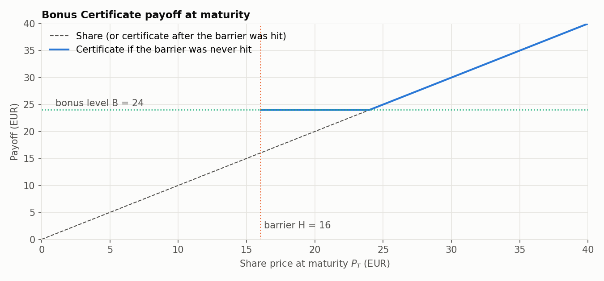
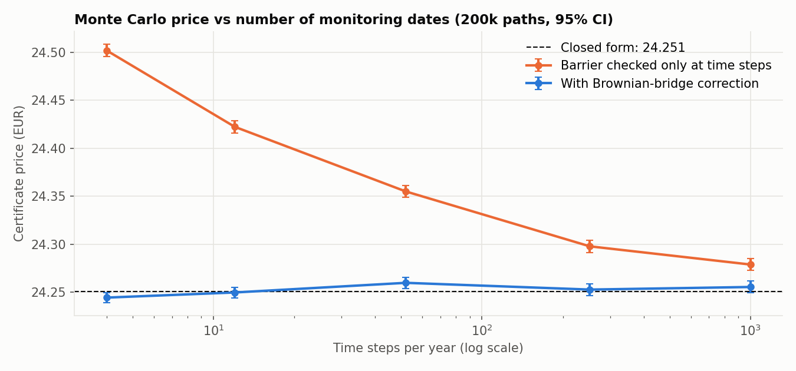
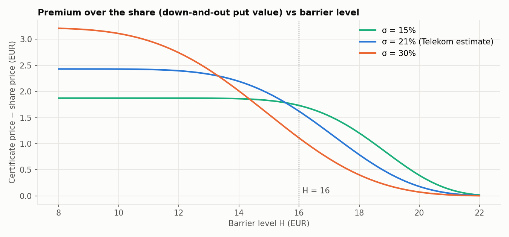
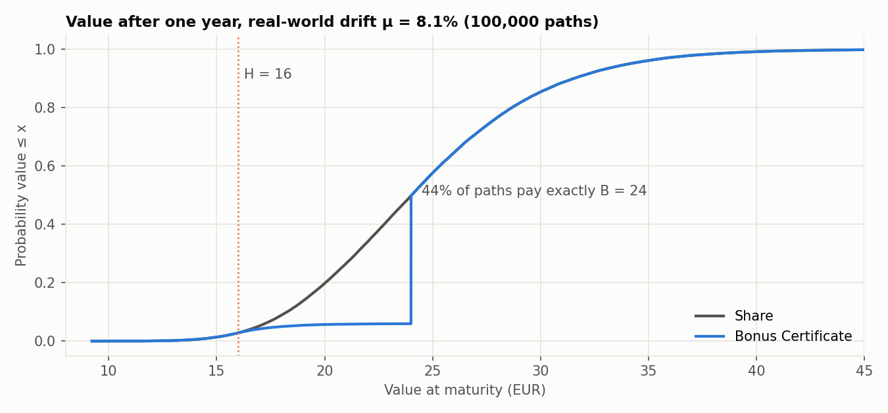

# Pricing Bonus Certificates under Black–Scholes

[](https://github.com/lapomazzari/Financial_Math/actions/workflows/tests.yml)

This project prices a **Bonus Certificate** on Deutsche Telekom stock. A Bonus Certificate is a structured product that pays a guaranteed bonus as long as the share never touches a lower barrier. The project covers three steps:

1. Calibrate a Black–Scholes model to ten years of daily prices.
2. Derive a closed-form price by replicating the certificate with a share and a down-and-out put.
3. Validate the price with Monte Carlo simulation and study the product's risk profile.



## The product

With bonus level $B$ and barrier $H < B$, the certificate pays at maturity $T$

$$
D = P_T + (B - P_T)^+ \cdot \mathbf{1}_{\{\min_{t \le T} P_t > H\}}.
$$

If the share never touches $H$, the investor receives at least $B$. Otherwise they simply get the share. The payoff is therefore **one share plus a down-and-out put** with strike $B$ and barrier $H$. Using put–call parity inside the barrier indicator, the price is

$$
V_0 = \mathrm{DOC}(P_0; B, H) + e^{-rT} B\, Q^{(2)} - P_0\left(Q^{(1)} - 1\right),
$$

where $\mathrm{DOC}$ is a down-and-out call and $Q^{(1)}, Q^{(2)}$ are the probabilities that the barrier is never hit under the share measure and under the risk-neutral measure. The full derivation is in the [notebook](notebooks/bonus_certificate_pricing.ipynb).

## Results

The example certificate has spot $P_0 = €22.63$ (14 Jun 2024), $B = €24$, $H = €16$, $T = 1$ year and $r = 2\%$. The volatility $\hat\sigma = 21.2\%$ is estimated from Telekom log-returns over 2014–2024.

| | Value |
|---|---|
| Share | €22.63 |
| Down-and-out put | €1.62 |
| Vanilla put with the same strike, for comparison | €2.43 |
| **Bonus Certificate** | **€24.25** |
| Risk-neutral probability that the barrier is never hit | 89.5% |

**Monte Carlo confirms the closed form, once the barrier is monitored correctly.** Checking the barrier only at the simulation time steps misses crossings between steps, so it overprices, and the bias shrinks only slowly as the grid gets finer. A **Brownian-bridge correction** weights each path by its probability of surviving between time steps. It matches the closed form within the 95% confidence interval, even with just 4 steps per year.



**Investors in the certificate are short volatility.** The certificate's premium over the share is the value of the down-and-out put:

- With a distant barrier, it behaves like a vanilla put and gains value with volatility.
- With the barrier as close as here, higher volatility makes a knock-out more likely, so the certificate *loses* value.



**Risk profile.** Simulated under the real-world drift ($\hat\mu = 8.1\%$):

- 44% of scenarios pay exactly the bonus level.
- The 5% quantile rises from €16.9 (share) to €18.0 (certificate).
- In the 6% of scenarios where the barrier is hit, the certificate offers no protection at all.



## Repository structure

```
├── notebooks/bonus_certificate_pricing.ipynb   # full analysis: data → calibration → pricing → MC → risk
├── src/bonus_certificate/
│   ├── pricing.py        # Black–Scholes, down-and-out call, barrier survival probabilities, certificate price
│   ├── monte_carlo.py    # GBM paths, antithetic sampling, Brownian-bridge barrier correction
│   └── estimation.py     # data loading and GBM calibration
├── tests/test_pricing.py # parity, limiting cases, MC vs closed form, calibration, headline numbers
├── scripts/make_figures.py
├── data/telekom.csv      # Deutsche Telekom (DTE.DE) daily closes, Jun 2014 – Jun 2024
└── docs/figures/
```

## Getting started

```bash
pip install -e ".[dev]"
pytest                       # 8 tests, ~5 s
jupyter lab notebooks/bonus_certificate_pricing.ipynb
python scripts/make_figures.py
```

```python
from bonus_certificate import bonus_certificate_price, bonus_certificate_mc

bonus_certificate_price(S=22.63, B=24, H=16, r=0.02, sigma=0.2124, T=1)   # 24.251
bonus_certificate_mc(22.63, 24, 16, 0.02, 0.2124, 1, n_steps=52)          # ≈ (24.25, 0.004): price, std. error
```

## Background

Originally written as the graded bonus project for *Financial Mathematics 2* at the Technical University of Munich (summer semester 2025), then refactored into a tested package.
